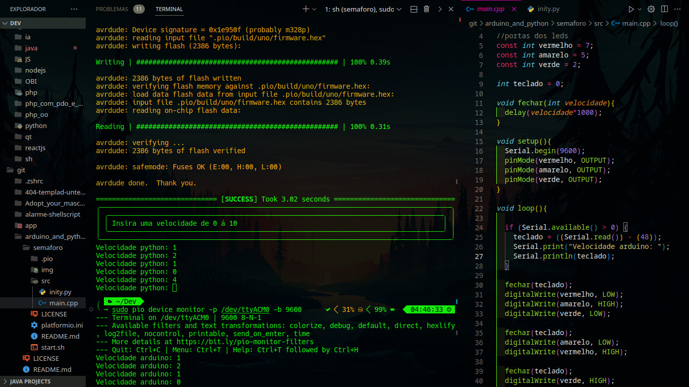
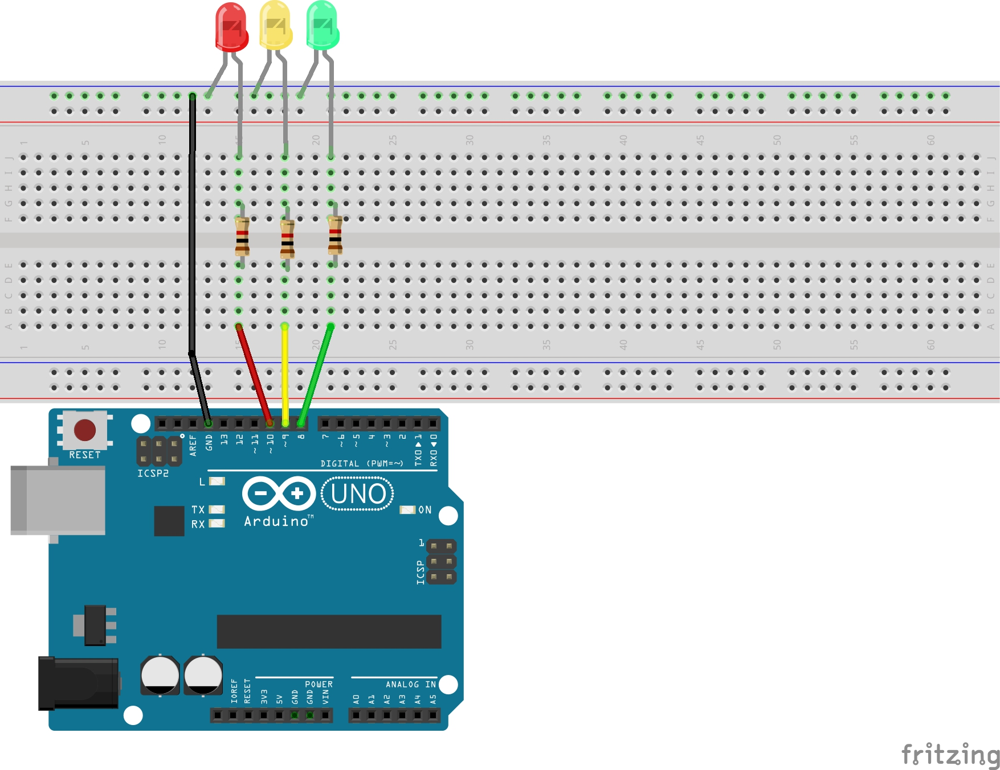

<pre>
    ________________________________
   /                               /\              o  .      #
  |                               |_/             . .  .    ##
  | Semaforo com python e arduino |                . O o .  ###
   \                               \             .  o  .     #
    \       by: Diego Horvatti      \              o O.      |
     |                               |             . o O     |/|
     |     Led vermelho: porta 7     |             ___o_    /,,|
     |                               |             | O |   |,,,|
    /    Led amarelo: porta 5       /              |o .|   | ,,|
   |                               |               | .o|   | , |
   |   Led verde: porta 2          |               |O  |   | , |
    \                               \              | .O|   |   |
     |   github.com/Textualize/rich  |           __|o .|__ |   |
     |   pyserial.readthedocs.io     |          / . O o  o\|   |
     |   ascii.co.uk/art/lightbulb   |         /. O .o .O .\   |
     /   platformio.org              |        |^^^^^^^^^^^^^|  |
  __/___________________________    /         |             |__|_
 /                             /   /           \           /======
 \                             \__/             \_________/
  `-----------------------------'
</pre>

<h3>Libis:</h3>
<ul>
  <li>yay platformio</li>
  <li>yay python3 or python2</li>
   
  <li>pip install pyserial</li>
  <li>pip install rich</li>
</ul>

<h3>Compilação:</h3>
<pre>bash ./start.sh</pre>

<h3>Monitor serial:</h3>
<pre>sudo pio device monitor -p /dev/ttyACM0 -b 9600</pre>

 

